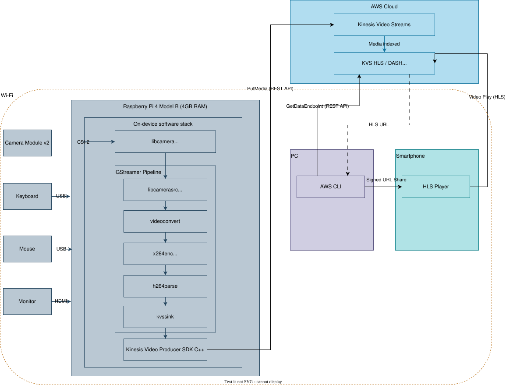
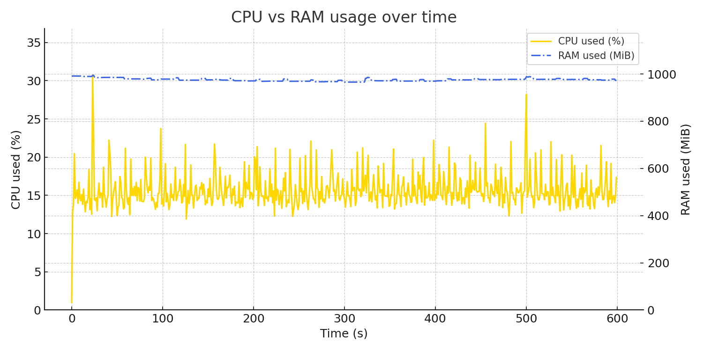

# Raspberry Pi × AWS Kinesis Video Streams ― PoC



## What is this?

This is a live-streaming PoC that takes video from a Raspberry Pi 4 (Camera Module v2), pipes it through GStreamer → Kinesis Video Streams (PutMedia) → HLS (Archived Media), and lets you watch it on a PC or smartphone.

| Item | Value |
|------|-------|
| Resolution | 640×480 |
| Framerate  | 30 fps |
| Encoder    | `x264enc` (software) / 1.5 Mbps |
| Latency (end-to-end, HLS) | ≈ 10 s |

## Pipeline (GStreamer)

```bash
gst-launch-1.0 -e \
  libcamerasrc ! \
  video/x-raw,width=640,height=480,framerate=30/1 ! \
  x264enc tune=zerolatency speed-preset=ultrafast bitrate=1500 key-int-max=30 ! \
  h264parse config-interval=1 ! \
  kvssink stream-name=sdv-pi4-frontcam-20250430 aws-region=ap-northeast-1
```

## How to watch (HLS)
 1. Get DataEndpoint for HLS
```bash
ENDPOINT=$(aws kinesisvideo get-data-endpoint \
  --stream-name sdv-pi4-frontcam-20250430 \
  --api-name GET_HLS_STREAMING_SESSION_URL \
  --region ap-northeast-1 \
  --query DataEndpoint --output text)
```

 2. Get signed HLS URL (valid 30 min)
```bash
aws kinesis-video-archived-media \
  --endpoint-url $ENDPOINT \
  get-hls-streaming-session-url \
  --stream-name sdv-pi4-frontcam-20250430 \
  --playback-mode LIVE \
  --region ap-northeast-1 \
  --query HLSStreamingSessionURL --output text
```

You can play the stream simply by pasting the signed URL into a smartphone or PC browser.

## Performance (HLS SW-encode)

| Metric | Peak | Average |
|--------|------|---------|
| CPU (user+sys) | ~30 % | 12 % |
| RAM used       | ~1 GiB | 450 MiB |



Please refer to [metrics/perf_20250502.csv](metrics/perf_20250502.csv) for the full CSV.

## TODO
- Measure latency with the hardware-encoded (v4l2h264enc) pipeline
- Compare results with the WebRTC (KVS Signaling) version
- Turn the pipeline into a systemd service with automatic restart
